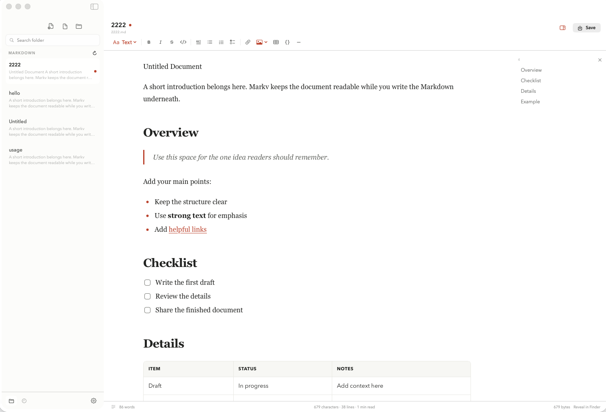

# MarkV

[](https://www.apple.com/macos/)
[](https://www.swift.org/)
[](LICENSE)

MarkV is a focused, native Markdown reader and WYSIWYG editor for macOS. It combines a quiet writing surface with folder browsing, full-text search, recent files, document outlines, live Markdown formatting, and compact PDF export.



## Highlights

- Native macOS application built with SwiftUI and WebKit
- Typora-inspired single-canvas WYSIWYG Markdown editing
- Folder library with opening-content previews and full-text search
- File context actions for PDF export, path copying, and confirmed Trash deletion
- Recent-file navigation and drag-and-drop opening from Finder
- Transparent, resizable document outline with heading navigation
- Automatic Markdown shortcuts for headings, quotes, lists, tasks, and fenced code
- Formatting tools for emphasis, links, images, tables, code, rules, and task lists
- Local image uploads, Finder image drops, and clipboard image paste into an automatic `IMG` folder
- Khaki and white reading themes
- English and Simplified Chinese interface languages
- Optional OpenAI-compatible AI editing with custom endpoint and model settings
- Built-in GitHub release checks with a quiet update indicator
- Native Markdown file association with an in-app default-application setting
- Focus mode and typewriter mode
- Word, character, line, and reading-time statistics
- Vector-based, paginated A4 PDF export
- Local-first operation with no analytics and no document uploads

## Download

Download the latest Apple Silicon DMG from the [GitHub Releases page](../../releases/latest).

The v1.7.1 downloadable build is ad-hoc signed and is not notarized by Apple. To install:

1. Open the DMG and drag **Markv.app** to **Applications**.
2. Launch **Markv.app** from Applications. If macOS blocks the first launch, open **System Settings > Privacy & Security > Open Anyway**, then confirm **Open**.

Because this build is not notarized, macOS may require the [first-launch confirmation](https://support.apple.com/102445) above. Future builds made with a Developer ID certificate can use the notarized release workflow documented below.

The current release requires macOS 14 or later. The prebuilt DMG targets Apple Silicon (`arm64`).

## Using MarkV

Open a Markdown folder from the sidebar or use **File > Open File** for a standalone document. The sidebar can search both file names and complete Markdown content. Double-click the document name in the title area to rename the file while preserving its Markdown extension.

Type Markdown naturally in the editor. Common block prefixes convert automatically after typing a space or pressing Return:

- `# ` through `###### ` for headings
- `> ` for blockquotes
- `- ` for bullet lists
- `1. ` for numbered lists
- `[ ] ` or `[x] ` inside a list for tasks
- Triple backticks or tildes for fenced code blocks

### Images

Use the image button to insert an image URL or upload a local image. Uploaded, dropped, and pasted images are copied into an `IMG` folder beside the current Markdown document. MarkV automatically resolves duplicate file names and inserts a portable relative Markdown path instead of embedding base64 data.

Right-click a file in the library to export it as PDF, copy its full path, or move it to the Trash after confirmation.

### Optional AI extension

Enable AI in Settings and configure an OpenAI-compatible Base URL, model name, and optional API key. The key is stored in macOS Keychain rather than UserDefaults or Markdown files.

Select text and use the sparkle menu to improve writing, fix spelling and grammar, shorten, lengthen, or provide a custom instruction. MarkV shows the original and proposed revision before you choose Replace, Insert Below, Try Again, or Discard. Type `/` in an empty paragraph to open the AI content-generation prompt.

The integration uses the OpenAI-compatible [Chat Completions](https://developers.openai.com/api/reference/cli/resources/chat/subresources/completions) request shape. Custom remote endpoints must use HTTPS; HTTP is limited to localhost services.

### Keyboard shortcuts

| Action | Shortcut |
| --- | --- |
| New empty document | `Command-N` |
| Open file | `Command-O` |
| Open folder | `Shift-Command-O` |
| Save | `Command-S` |
| Export PDF | `Shift-Command-E` |
| Bold | `Command-B` |
| Italic | `Command-I` |
| Inline code | `Command-Backtick` |
| Focus mode | `Option-Command-8` |
| Typewriter mode | `Option-Command-9` |
| Increase document font size | `Command-=` |
| Decrease document font size | `Command--` |
| Reset document font size | `Command-0` |

Settings includes separate font-size controls for document text and the file sidebar. Changes take effect immediately and are remembered for future sessions.

## Build from source

### Requirements

- macOS 14 or later
- Xcode 16 or later with the Swift 6 toolchain

Clone the repository and build the application bundle:

```bash
git clone https://github.com/kennyz/MarkV.git
cd MarkV
./scripts/build-app.sh
open dist/Markv.app
```

The build script creates `dist/Markv.app`, generates the application icon, and applies an ad-hoc local signature.

Maintainers with a Developer ID certificate and a `notarytool` Keychain profile can create a signed, notarized, and stapled DMG with:

```bash
MARKV_SIGN_IDENTITY="Developer ID Application: Your Name (TEAM_ID)" \
MARKV_NOTARY_PROFILE="markv-notary" \
./scripts/build-notarized-dmg.sh
```

The notarization profile is read from macOS Keychain; no Apple credentials are stored in the repository or build scripts.

Run MarkV directly with Swift Package Manager:

```bash
swift run --disable-sandbox Markv
```

Run the test suite:

```bash
swift test --disable-sandbox
```

## Project structure

```text
Sources/Markv/       SwiftUI application, editor bridge, rendering, and models
Tests/MarkvTests/    Unit and regression tests
Resources/           Application bundle metadata
scripts/             App bundle and icon build scripts
docs/plans/          Product and implementation design notes
```

MarkV has no third-party runtime dependencies. Markdown parsing, WYSIWYG synchronization, file search, and PDF pagination are implemented in the project using Apple platform frameworks.

## Privacy

MarkV reads and writes only the files you explicitly open. Search indexing stays in memory on your Mac. The application does not collect analytics or upload documents by default. The optional AI extension is disabled by default; when you invoke it, only the selected text or AI prompt needed for that request is sent to the endpoint you configured.

## Contributing

Issues and pull requests are welcome. Please run the full test suite before submitting a change and keep new behavior covered by focused regression tests.

## License

MarkV is available under the [MIT License](LICENSE).
